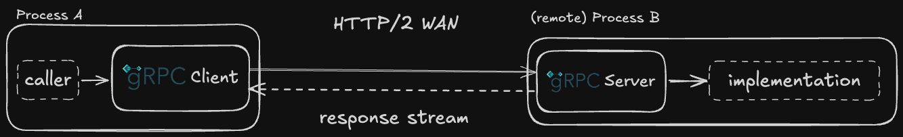
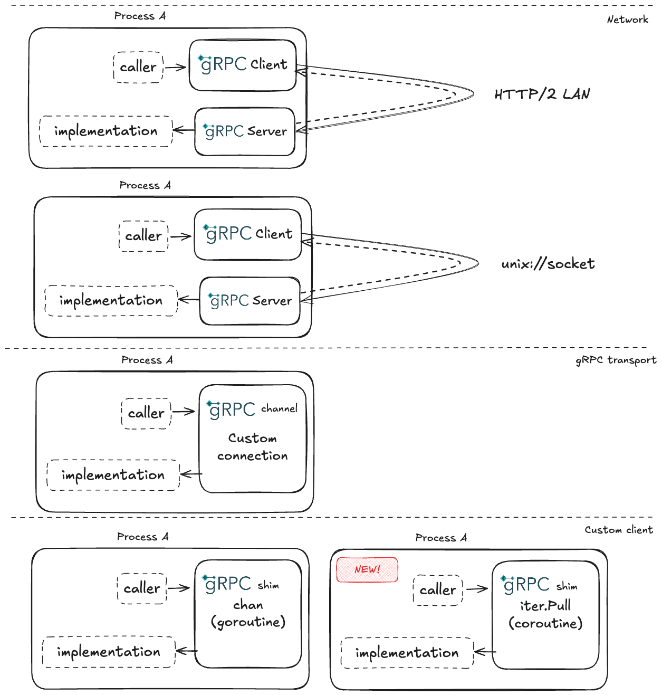

A few years back I have been exploring solutions for [the in-process gRPC](https://github.com/grpc/grpc-go/issues/906) pattern in Go, for [the Thanos project](https://thanos.io/). Recently, a friend and a Thanos maintainer [Filip](https://github.com/fpetkovski) refreshed [the initial Thanos solution](https://github.com/thanos-io/thanos/pull/7796) with [the new Go 1.23 iterators](https://go.dev/blog/range-functions).

This created a perfect opportunity to share, in a co-authored blog post, what Filip and I learned about the new iterators, new `coroutines` (not `goroutines`!) and what options you have for the production in-process gRPC logic. Given our limited time, why not explore all in one blog post, what could go wrong? (: 

## gRPC calls in Go

[gRPC](https://grpc.io/) is a popular open-source Remote Procedure Call (RPC) framework with a few unique elements like a tight [protobuf](https://protobuf.dev/) integration, HTTP/2 use and a native bi-directional streaming capabilities. Before we move to the advanced `in-process` gRPC problem space, let's define [an example gRPC service](https://github.com/bwplotka/benchmarks/blob/9dd13b9e17bb935053a723ec4c88a6272759754b/benchmarks/local-grpc/dev/bwplotka/list/v0/list.proto#L7C1-L9C2) that "lists" strings in form a gRPC server stream:

```protobuf
service ListStrings {
  rpc List(ListRequest) returns (stream ListResponse) {}
}

message ListRequest {};

message ListResponse {
  repeated string strings = 1;
}
```

With the help of [protoc](https://protobuf.dev/reference/go/go-generated/#invocation) or [buf](https://github.com/bwplotka/benchmarks/blob/9dd13b9e17bb935053a723ec4c88a6272759754b/benchmarks/local-grpc/buf.gen.yaml#L2) (invoked [like this](https://github.com/bwplotka/benchmarks/blob/9dd13b9e17bb935053a723ec4c88a6272759754b/benchmarks/local-grpc/Makefile#L12)) and Go and gRPC plugins we can generate Go client and server interfaces (with the corresponding stream interfaces) that looks like this:

Client:

```go
type ListStringsClient interface {
	List(ctx context.Context, in *ListRequest, opts ...grpc.CallOption) (grpc.ServerStreamingClient[ListResponse], error)
}

// Server-stream client allows receiving messages.
type ServerStreamingClient[T any] interface {
  Recv() (*T, error)
}
```

Server:

```go
type ListStringsServer interface {
  List(*ListRequest, grpc.ServerStreamingServer[ListResponse]) error
}

// Server-stream server allows sending messages.
type ServerStreamingServer[T any] interface {
  Send(*T) error
}
```

With those, a piece of code that needs strings (a "caller") can list them using the `List(ctx, &ListRequest{})` method. This will start a gRPC (HTTP/2) stream that allows receiving strings via the `Recv()` method. On the other side, you can implement the server `ListStringsServer` interface that sends strings to clients via the `Send(msg)` method.

As a result, you can deploy various processes e.g. remotely, so across different machines, that pass data from one to another:


 
## Transparent, in-process gRPC calls

In 2020, Thanos project had 3 years and already was using gRPC heavily for its distributed design (a few microservices). We started to [play around with different architectures and abstractions](https://github.com/thanos-io/thanos/commit/202fb4d46f35b91577bbc977d46c27f0e6f15e900) for efficiency and maintainability. This is when we saw a need for and efficient, yet transparent `in-process` gRPC flow. Let's unpack what we mean and what it helps with using the mentioned `ListStrings` gRPC service example.

Imagine you want a service that hides multiple `ListStrings` servers and exposes them as a one "proxy" `ListStrings` server. This is a common "fan-out" pattern, useful when you want to implement advanced server-side logic like filtering, deduplication, load balancing, data sharding or even [request hedging](https://dzone.com/articles/request-hedging-applicability-benefits-trade-offs). You can deploy it as an individual process serving `ListStrings` gRPC service that also calls multiple `ListStrings` remote servers.

However, we noticed a few use cases for embedding some servers in the same process. For example:

* Embedding the same proxy `ListStrings` server on the client side (e.g. in-memory sharding or client load-balancing).
* Embedding some `ListStrings` server on the process with the proxy `ListStrings` server; making our proxy transparently using the same logic for both remote and local servers.
* Testing (avoiding the need of a full HTTP server and client).

Solving this use case (somewhat captured by the [#906 issue](https://github.com/grpc/grpc-go/issues/906)) efficiently, proven to be not as trivial as you might think, especially for gRPC calls that are heavy on data (e.g. in Thanos we stream GBs/s of metrics from one service to another). The gRPC framework was designed for the "remote" calls (literally "R" in the gRPC acronym). For example, notice that you can't simply implement the `ListStringsClient` client with the same server code that implements the `ListStringsServer` interface. The key difference is actually in the server stream interfaces, so `ServerStreamingClient[T any]` vs `ServerStreamingServer[T any]`. The former (client) is **pulling** the messages via the `Recv()`. The latter (server) is **pushing** the messages via the `Send(...)`.

At first, it might not be intuitive why that is a problem for an in-process execution. The client is waiting on the data and the server is eventually pushing it. What did we expect, both pulling the data? Well, technically speaking yes, for **the sequential execution** it would be better if the client would **pull** and the server would **implement the pull interface** or the client would implement the **push interface** and the server would **push**.

Why? It's because mixing pulling with pushing for a stream of data requires, either:
 
* **Synchronization and buffering** for all the messages, which defies the point of asynchronous streaming. We don't discuss synchronous behavior in this blog, if you are fine with synchronization you can just stop using gRPC server streaming and not have this in-process problem.
* A **medium** (shared network, memory or Go channel) and **concurrency** (like process or goroutine) which incurs some overhead.

### Five Options

Long story short, we have, currently, five practical options:



1. A process calling its own gRPC server on the localhost HTTP port.
2. A process calling its own gRPC server on the [Unix](https://en.wikipedia.org/wiki/Unix_domain_socket) socket.
3. Using the brilliant [`grpchan/inprocgrpc`](https://pkg.go.dev/github.com/fullstorydev/grpchan@v1.1.1/inprocgrpc) gRPC channel implementation. The [gRPC channel](https://grpc.io/docs/what-is-grpc/core-concepts/#channels) can be thought of as an abstraction over TCP transport that could be swapped with a custom implementation.
4. We can implement custom client that uses a single Go channel and another goroutine to integrate `Send(...)` with `Recv()`.
5. Since Go 1.23, we can use an exciting new `iter` package to pull (receive) the `Send(...)` calls, which we wanted to explore further in this blog post!

If you can't wait to learn the pros and cons of each, feel free to fast-forward to the [Summary](#summary-whats-the-best-option). Otherwise, let's jump into new iterators and how they help with our in-process gRPC challenge! 💪

## Go 1.23 `iter` package and coroutines

*Filip*: The rationale behind introducing coroutines was described in Russ Cox's blog post [Coroutines for Go](https://research.swtch.com/coro). The main motivation is enabling developers to write safe and efficient iterators. A key difference with goroutines is that a coroutine introduces concurrency without additional parallelism. In other words, coroutines can't be preempted by other coroutines. They are designed to only switch (e.g. and resume other coroutine) at the explicit point in the program. Another way I typically summarize it is that goroutines are for working concurrently, coroutines are for waiting concurrently.  

It is this particular difference which often unlocks more efficient implementations since there is no need to use synchronization primitives like channels or locks. Scheduling is also cheaper as there's no preemption. More concretely, Russ reported a 10x improvement in performance when reading values from a coroutine-based iterators vs a goroutine and a channel, or 20ns per read value vs 400ns per read value. In absolute terms, these numbers can seem small, but they can easily accumulate in high throughput environments where servers have to handle thousands of requests per second. Another disadvantage of goroutines and channels is that they create more garbage, thereby adding more pressure on the garbage collector.

Coroutines were added to the Go runtime in 1.23 with the introduction of the `iter` package. This package adds two new types, `iter.Seq` and `iter.Seq2` which can be used to implement iterators returning one and two values respectively. The easiest way to start using iterators is by implementing a function whose definition satisfies one of these two types and using it in a for loop. A simple implementation of the iterator that reads a file line by line can be seen below (also in [playground](https://go.dev/play/p/TQDfn88AoAU)): 
 
```go
var lineReader iter.Seq2[string, error] = func(yield func(item string, err error) bool) {
    f, err := os.Open(filePath)
    if err != nil {
        yield("", err)
    }
    defer f.Close()
    
    scanner := bufio.NewScanner(f)
    for scanner.Scan() {
        if !yield(scanner.Text(), nil) {
        }
    }
    if err := scanner.Err(); err != nil {
        yield("", err)
    }
}

for line, err := range lineReader {
    if err != nil {
        // handle err
    } 
    // use line
}
```

Note that we can open the file in the iterator function, and close it with a `defer` statement once we are done reading its contents. This makes the iterator safe to use since the caller does not have to worry about cleaning up resources, the tear down logic is already encapsulated in the iterator implementation.

The easiest way to consume an iterator is by ranging over it in a for loop. There are cases though, when we might need more control over how and when we read values from it. One such case is the gRPC in-process client implementation described above, where we need to implement a pull based API on top of a push based one. The `range` keyword automatically does this for us, but we can also get explicit control knobs using the `iter.Pull` and `iter.Pull2` functions. For example instead of for loop we can use our example `lineReader` as follows ([playground](https://go.dev/play/p/3IpQrwbEzWw)):

```go
next, stop := iter.Pull2(lineReader)
defer stop()
for {
    line, err, ok := next()
    if !ok {
        break
    }
    if err != nil {
        // handle err
	} 
    // use line
}
```

Note that `iter.Pull2` returns a `stop` function which can be called at any time in order to terminate the iterator. Although consuming iterators this way can be more flexible, it is important to make sure the iterator is either fully exhausted, or `stop` is called once the caller is no longer interested in the next value. Otherwise, the iterator function would never terminate, leading to resource leaks.

### gRPC in-process implementation with `iter`.

Using these concepts, we [rewrote the in-process client implementation](https://github.com/thanos-io/thanos/pull/7796/files#diff-3e3656359cc24ff074e50571d47b0b7fa4229f2be8fc0511b126d91c94fa4883) to use a coroutine instead of a goroutine and a channel. The iterator function opens a local server stream which is push based as it relies on the `Send` method from the gRPC framework. The client, on the other hand, has a `Recv` method, making it pull based. As described above, we could bridge this gap elegantly by using `iter.Pull2`, converting a push based to a pull based iterator and handing it off to the client. Our initial implementation had a subtle bug where the client would not call `stop` when a query was cancelled. This lead to readers remaining open indefinitely, causing deadlocks in certain situations. It was a great lesson illustrating the drawbacks of consuming iterators outside the happy path, namely by using the `range` keyword.

To show the usability of `iter` package for in-process gRPC, see the implementation for our example `ListStrings`. The `newServerAsClient` allows calling `ListStrings` server with the client gRPC interface. All with the relatively simple code ([playground](https://go.dev/play/p/MEz1qN63p72)):

```go
func newServerAsClient(srv ListStringsServer) ListStringsClient {
	return &serverAsClient{srv: srv}
}

type serverAsClient struct {
	srv ListStringsServer
}

func (c *serverAsClient) List(ctx context.Context, in *ListRequest, _ ...grpc.CallOption) (grpc.ServerStreamingClient[ListResponse], error) {
	y := &yielder{ctx: ctx}

	// Pull from iter.Seq2[*ListResponse, error].
	y.recv, y.stop = iter.Pull2(func(yield func(*ListResponse, error) bool) {
		y.send = yield
		if err := c.srv.List(in, y); err != nil {
			yield(nil, err)
			return
		}
	})
	return y, nil
}

type yielder struct {
    grpc.ServerStreamingClient[ListResponse]
	grpc.ServerStreamingServer[ListResponse]

	ctx context.Context

	send func(*ListResponse, error) bool
	recv func() (*ListResponse, error, bool)
	stop func()
}

func (y *yielder) Context() context.Context { return y.ctx }

func (y *yielder) Send(resp *ListResponse) error {
	if !y.send(resp, nil) {
		return errors.New("iterator stopped receiving")
	}
	return nil
}

func (y *yielder) Recv() (*ListResponse, error) {
	r, err, ok := y.recv()
	if err != nil {
		y.stop()
		return nil, err
	}
	if !ok {
		return nil, io.EOF
	}
	return r, nil
}
```

## Summary: What's the best option?

In engineering, there is rarely a single best option, so let's take a look on all [five options](#five-options) and their strenghts.

| Option                 | Example `ListStrings`                                                                                                                               | `ListStrings` benchmark | Pros                                                                                                                                                                                                                                                                     | Cons                                                                                                                                                         |
|------------------------|-----------------------------------------------------------------------------------------------------------------------------------------------------|-------------------------|--------------------------------------------------------------------------------------------------------------------------------------------------------------------------------------------------------------------------------------------------------------------------|--------------------------------------------------------------------------------------------------------------------------------------------------------------|
| (1) localhost          | [implementation](https://github.com/bwplotka/benchmarks/blob/9dd13b9e17bb935053a723ec4c88a6272759754b/benchmarks/local-grpc/benchmark_test.go#L121) |                         | * Best compatibility (full gRPC logic).<br>* Simple to implement.                                                                                                                                                                                                        | * Expensive.<br>* Messages leak out of the process.                                                                                                          |
| (2) unix socket        | [implementation](https://github.com/bwplotka/benchmarks/blob/9dd13b9e17bb935053a723ec4c88a6272759754b/benchmarks/local-grpc/benchmark_test.go#L138) |                         | * Best compatibility (full gRPC logic).<br>* A tiny bit less overhead than localhost.<br>* Simple to implement.                                                                                                                                                          | * Still expensive.<br>* Messages leak out of the process.<br>* Not perfectly portable e.g. older versions of Windows.                                        |
| (3) inprocgrpc.Channel | [implementation](https://github.com/bwplotka/benchmarks/blob/9dd13b9e17bb935053a723ec4c88a6272759754b/benchmarks/local-grpc/benchmark_test.go#L166) |                         | * Proto definition agnostic.<br>* Avoids the expensive proto serialization.<br>* Fully in-process, avoids HTTP serving/client overhead.<br>* Supports all the timeouts, trailers and metadata (think HTTP headers) that gRPC framework offers.<br>* Simple to implement. | * Overhead of cloning the messages for generic correctness.                                                                                                  |
| (4) goroutine          | [implementation](https://github.com/bwplotka/benchmarks/blob/9dd13b9e17bb935053a723ec4c88a6272759754b/benchmarks/local-grpc/benchmark_test.go#L229) |                         | * Almost the most efficient.                                                                                                                                                                                                                                             | * Hard to make it fully generic.<br>* Hard to suport proper gRPC trailers and metadata.<br>* Easy to make concurrency mistakes (leak goroutines, deadlocks). |
| (5) iter + coroutine   | [implementation](https://github.com/bwplotka/benchmarks/blob/9dd13b9e17bb935053a723ec4c88a6272759754b/benchmarks/local-grpc/benchmark_test.go#L298) |                         | * The most efficient.<br>* Relatively simple implementation.                                                                                                                                                                                                             | * Hard to make it fully generic.<br>* Hard to support proper gRPC trailers and metadata.                                                                     |

TBD: Verdict (it depends: there's no the best!)

## Resources and credits

TBD: Yolo list, curate it.

* [Benchmark](https://github.com/bwplotka/benchmarks/tree/main/benchmarks/local-grpc).
* https://github.com/grpc/grpc-go/issues/906
* https://github.com/thanos-io/thanos/pull/7796
* https://go.dev/blog/range-functions
* https://docs.google.com/presentation/d/1NuGOFDfb5sN-povUCouvGx05OtyFXdLFlANMZgGPLfg/edit#slide=id.g31a4995a9ac_0_376
* https://pkg.go.dev/github.com/fullstorydev/grpchan/inprocgrpc
* https://go.dev/src/runtime/coro.go

As always, thanks to all reviewers (e.g. A, B) and [Maria Letta for the beautiful Gopher illustrations](https://github.com/MariaLetta/free-gophers-pack).
