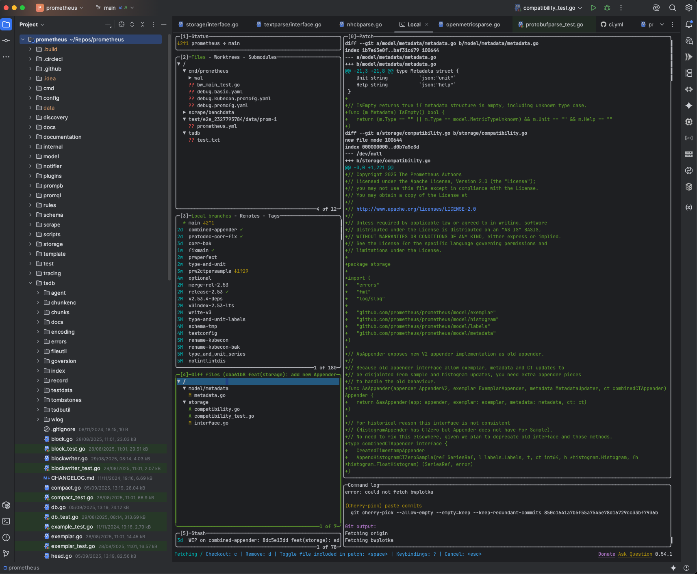
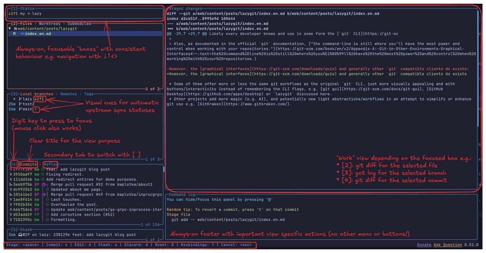
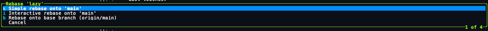
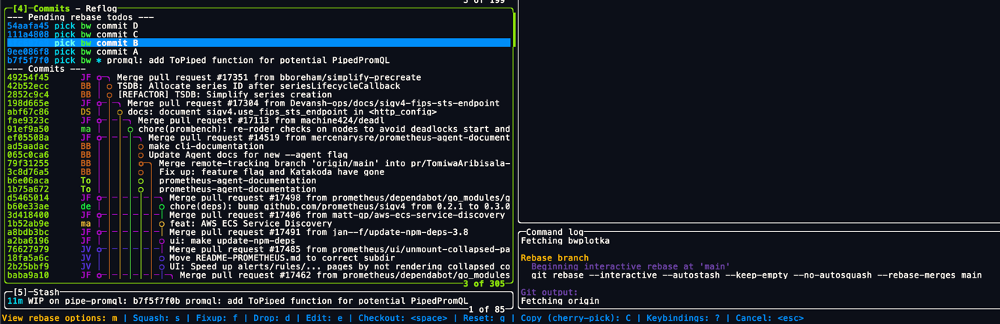
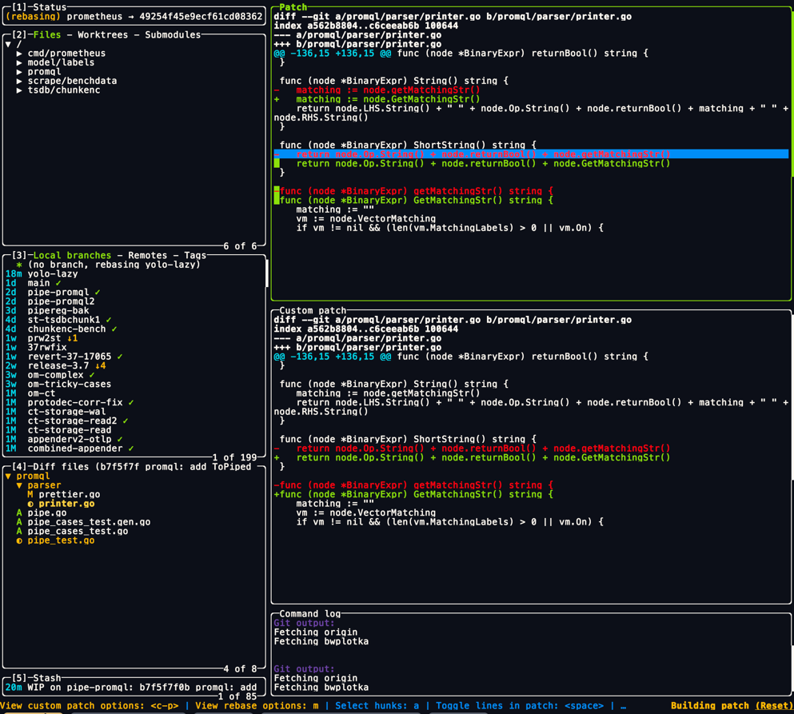
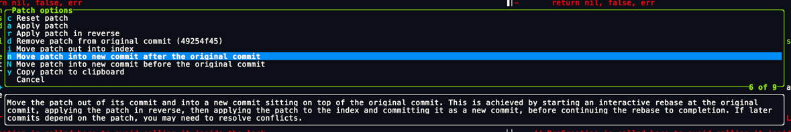

When my son was born last April, I had ambitious learning plans for the upcoming 5w paternity leave. As you can imagine with two kids, life quickly verified this plan 🙃. I did eventually start *some* projects. One of the goal (sounding rebellious in the current AI hype cycle) was to learn and use [neovim](https://neovim.io/) for coding. As a [Goland](https://www.jetbrains.com/go) aficionado, I (and my wrist) have always been tempted by no-mouse, OSS, [gopls](https://pkg.go.dev/golang.org/x/tools/gopls) based, highly configurable dev setups.

Long story short, I'd still stick to Goland for my professional coding (for now), but during the experiments with `nvim`, I accidentally stumbled upon [lazygit](https://github.com/jesseduffield/lazygit) Git UI. I literally mistyped `<space>gg` instead of `gg` which opened up the built-in `lazygit` overlay UI.
Week later I have already switched all my `git` workflows to `lazygit` (also outside `nvim`) and I use it since then. In this post I'd like to share why it happened so quickly, so:

* What makes `lazygit` so special
* How it can make you more productive.
* What we can all learn from `lazygit` around designing incredible software with seamless UX.

Let's jump in!

## Lazy approach to Git tools

Likely every developer knows and (in some form) use the [git CLI](https://git-scm.com/docs). It's relatively simple and it seems incredibly stable -- the only change I noticed in the last decade was the new `git switch` command. Although I still haven't "switched" to it from the lovely `git checkout`🙃 . As a result it's common to see developers memorize a few commands you typically use (for [my workflows](#my-typical-lazy-git-workflows) it would be `clone`, `fetch/pull`, `config/remote`, `add/rm`, `status`, `checkout`, `commit`, `push`, `cherry-pick`, `rebase`, `merge`, `log`) and stick to the CLI. In fact, in [2022, 83% of the StackOverflow responders said they prefer CLI than other interfaces](https://survey.stackoverflow.co/2022/#section-version-control-interacting-with-version-control-systems) and that number is likely still quite high nowadays.

However, the [graphical interfaces](https://git-scm.com/downloads/guis) and generally other `git` compatible clients do exists:

* Some of them offer more or less the same `git` workflows as the original `git` CLI, just more visually appealing and with buttons/interactivity instead of remembering the CLI flags, e.g. [git gui](https://git-scm.com/docs/git-gui), [GitHub Desktop](https://github.com/apps/desktop) or `lazygit` discussed here.
* Other projects add more magic (e.g. AI), and potentially new light abstractions/workflows in an attempt to simplify or enhance `git` use e.g. [GitKraken](https://www.gitkraken.com/).
* There are even projects like recently popular [jj](https://github.com/jj-vcs/jj) tool that completely abstracts away `git` API and replace it with a new source control flows to "simplify" them or unify them across various [VCS](https://en.wikipedia.org/wiki/Version_control) other than `git` (e.g. `mercurial`, Google [Piper](https://www.youtube.com/watch?v=W71BTkUbdqE&t=645s) and everything else you wished it was `git`, but it's not 😛).

What you choose for your work is entirely up to you. Depending on what you are passionate with, how you work with `git` and what type of software you are touching (monorepo vs small repos, close vs open source, GitHub vs other hosting solutions, where you deploy, etc.) different clients might be more or less productive for you.

> NOTE: If you're new to software engineering, don't skip learning using the `git` CLI. Even if you will use some higher level interfaces, it will help you understand what they do in the background, plus sooner or later you will end up debugging some remote VM or container with no UI access (especially CI systems).
>
> Also, as documented in the official `git` documentation, ["the command-line is still where you’ll have the most power and control when working with your repositories."](https://git-scm.com/book/en/v2/Appendix-A:-Git-in-Other-Environments-Graphical-Interfaces#:~:text=the%20command%2Dline%20is%20still%20where%20you%E2%80%99ll%20have%20the%20most%20power%20and%20control%20when%20working%20with%20your%20repositories.)

For me, I need something:

* simple and fast to limit the context switch overhead.
* `git` CLI native to have fewer things that can go wrong.
* "discoverable" and interactive as I am bad at remembering keybindings and commands (I need my brain memory for more fun bits).
  
For those reasons, early in my career I started depending on a hybrid workflow, with a few GUI tools:

* [git gui](https://git-scm.com/docs/git-gui) instead of `status`, `commit`, `config/remote`, `add/rm` and `push`.
* [gitk](https://git-scm.com/docs/gitk) instead of `log`.
* `git` CLI for everything else (e.g. rebasing/complex merging).
  
I don't remember why specifically those (AFAIK decade ago there wasn't anything else), but I literally have been using them non-stop until this year!

A few years ago, because of the 1990-style look of those UIs, lack of active development and modern features I looked around for some alternatives. I remember I was quickly demotivated when I accidentally lost all my local changes on a single mouse click on a wrong thing in one of the tools 🙈 (starts with `G` and ends with `N`). After that, I was sceptical I'd find some new tool anytime soon. The arguments to motivate me to make a switch would need to be strong.

Turns out, an open mind and a bit of curiosity in a random moment gave more fruits than a tailored research. By accident, I noticed `lazygit` and after a short try it became my main `git` tool.

## What's amazing in `lazygit`?

Somehow, [lazygit](https://github.com/jesseduffield/lazygit) ticked so many boxes for me:

* It's easy to use; makes you productive from day 1.
* It enables you to do more (and faster), even teaching you on the way.
* It's a TUI (terminal user interface) making it incredibly fast, portable and visually consistent.

Many of the tool's benefits are also amazing learnings on how to build brilliant devtools and software in general.

> `lazygit` used via [lazygit IntelliJ plugin](https://plugins.jetbrains.com/plugin/24917-lazygit-in-editor-terminal) on my `git` clone of Prometheus project.

Personally, probably the best thing about the `lazygit` is its UX, notably how easy is to use this tool with just basics understanding of `git` CLI. Generally, it feels that nice user experience is achieved due to deliberate choice of strong consistency, deliberate visualizations and interactive menus.  Let me explain.

### Consistency

`lazygit` is incredibly well organized and visually consistent. `lazygit` TUI consists of set of boxes ("views") with consistent behaviour. Most views are generally visible, always, no matter what operation you are doing (unless you zoom-in). You always have focus on one box. It's visibly clear some boxes have "tabs". When you interact with boxes on the left, the right box changes.

Then, `lazygit` generally sticks to native `git` terms and abstractions, which reduces the initial learning curve. In fact, this tool even teaches you about standard, yet a bit more advanced `git` operations (e.g. `bisect` which I used to do manually) and terms (e.g. TIL [`hunk`](https://medium.com/@michotall95/hunk-in-git-f7b7855d47ae) which is an official `git` term for a piece of relevant code).

Finally, by default, `lazygit` is pretty consistent with the feeling and keybindings of `vim`. This means that `q` will quit the tool, `h/j/k/l` (or arrows) are for navigation, `/` for filtering and `y` for copy. Then similar to `vim` it attempts to follow the name of the command, e.g. `c` commits, `a` adds all, `A` amends, `f` fetches, `p` pulls, `P` pushes, `r` rebases.

This is incredibly important as your common workflows can be easily memorized and invoked in a quick set of a few keystrokes (see [enhanced workflows](#enhanced-git-workflows)). Now, as I mentioned before, that's a double-edged sword, because if your brain is lazy like mine, you will end up staring at the `vim/nvim` view trying to remember what was the command to select and copy things (or [quit vim](https://cdn.sanity.io/images/jo7n4k8s/production/7a0bf96c6e3155ca56c74723cb0c0767517a4429-324x318.jpg?auto=format)).

`lazygit` solves the above with having limited set of commands (that's a good thing: [do one thing and do it well](https://en.wikipedia.org/wiki/Unix_philosophy)) and great "discoverability".

### Discoverability

`lazygit` strikes an amazing balance of showing data you need when you need. When you open this tool, it's obvious you want to do some `git` trickery, so it's likely a good thing to give you, all you need to know in a pill:

* What repo is this.
* All staged and unstaged files with changes (`git status`).
* What branch you are on.
* The top ~10 commits on this branch.
* Top stash item.
* Last git commands you performed.
* Core actions/commands you can do with their keybindings.

It's a lot of data! Yet `lazygit` somehow managed to show you all of this without visually overwhelming the user:

> Consistent and self-explanatory views with flat action menu allows you to find the data you need when you need quickly.

This context is game changing:

* If you never used this tool, or if you had spend one month doing meetings, reviews and design docs at work, and you return to coding finally, you immediately know **where are you** and **where are things**.
* It reduces the risk of surprises and mistakes (`"ups! I pushed to main directly sorry!"`), saving you a solid amount of `SWEh` (software engineering hours) monthly.
* Normally to double-check those things you would need to run multiple commands and check different windows. `lazygit` immediately removes that context switching.
* Even if you forget important keybindings for actions it's quick to check it on footer or with `?`.

But there's more, `lazygit` guides you on all operations with interactivity.

### Interactivity

In every other UI tool you have hundreds of buttons, with multiple layers of nested menus. `lazygit` has a different approach. This tool guides you one, teaching you on the way on what's possible and when. For example:

* Push will give you warning of divergence with upstream if any. Clicking `Enter` will do `--force` push, `Esc` will cancel.
* Rebase will ask you, if want the interactive one or not and double-check the branch.

* Interactive rebase is much more guided and interactive, then `git rebase --interactive`. No need to manually type and remember special words (e.g. `pick/drop/squash` or `p/d/s`). The `<c-j>`, `<c-k>` keys also quickly move commits up and down (reordering).

* Git conflicts after rebase will be highlighted. After you fix them `lazygit` automatically will ask you if you want to commit them and auto continue the rebase.
* When switching branches with conflicting changes, `lazygit` will automatically ask you if you want to auto-stash those changes etc.

Generally, `laygit` guides you in your workflows with minimal distributions and guess work. This builds trust very quickly allowing adoption of faster workflows.

## Enhanced git workflows

Eventually, `lazygit` boosted productivity around git workflows for me as it does for many people.

What's impressive, is that `lazygit` does it without adding entirely new workflows. Instead, it makes what `git` CLI offers much more usable, safer, quicker and discoverable. It teaches you a better patterns.

One example is highlighted with custom patching. Imagine you made some changes, commited them, but then you want to bring back a few lines (but not all) to what it was before, from a commit before. My previous flow used to be either:

* Local IDE history (slow-ish, too much granularity (every file save), not always available).
* In my previous GUI `git gui` tool I click `ammend` which was pulling all changed files from that commit to `staged` area, then I find lines I want, manually copy them (with those git diff `+` and `-` chars!) and paste to IDE, then trim unwanted chars. Pretty horrible habit (:  

When using `lazygit`, I obviously tried to replicate my broken workflow. I couldn't because `lazygit` diffs are not intuitively select+copy-able (it might be fixable over time; not the highest priority, but people want this e.g. [1](https://github.com/jesseduffield/lazygit/issues/4511), [2](https://github.com/jesseduffield/lazygit/issues/4365)). I even [+1 one some issue around it](https://github.com/jesseduffield/lazygit/issues/3967#issuecomment-3159742037), and I'm glad I did, because the maintainer pointed me to... 10x simpler workflow: native reset/patch per line/hunk flow!

> All git diffs in `lazygit` (no matter if unstaged/staged/stashed/committed changes) support per line or per hunk selection and patching/selection.

With this, my "line reset from the last commit" workflow is way more simple, within a single place and works for any commit (not only latest): *focus on commits view > select commit > select file > select lines to reset > patch options > "remove patch from the original commit"*. All either mouse assisted or `4 enter enter space <c-p> d` within seconds.

Those short key bindings is game changer in general. I'd recommend starting with slower, but careful mause assisted flow, then naturally, because you do same actions so many times you memorize needed keystrokes. For me, after some time some quick flows became a habit, and I was using shortcuts unconsciously!

As a result, my common `git` flows, with `lazygit` were significantly improved.

Iterating on changes and updating upstream (my typical flow to ensure clean commit log):

* *select files to commit > add to the last commit (amend) > force push*
* `2 space A P enter`

Iterating on changes and updating upstream with new commit:

* *select files to commit > create new commit > push*
* `2 space c <type commit title> P`

Syncing branches (I generally do an interactive rebase, avoiding merges, unless squashed)

* *select branch > rebase > interactive rebase > arrange commits > rebase options > continue*
* `3 r i <s/p/d/.. to arrange rebase> m c`

Removing unwanted commit from history (normally you would need to do full interactive rebase against HEAD~4 or something!)

* *select commit > drop*
* `4 d`

Removing unwanted file change from commits

* *select commit > select file > remove*
* `4 enter d`

Splitting commit into multiple PRs/commits (painful normally)

* *select commit > select file > select lines or hunks > patch options > move patch into new commit after the original commit > create new commit*
* `4 enter enter <c-p> n <type commit title> enter`

  

Cherry-pick (typically meant copying commit SHAs around; prone to errors)

* *select branch > select commit > copy for cherry-pick (you can buffer many) > select target branch > go to commits > paste*
* `3 4 C 3 4 V`

...and many more!

## What can we learn?

To me, `lazygit` is not only an amazing tool for everyday use, but also an inspiration around devtools UX. The [simplicity, consistency, discoverability, sane defaults, shortcuts for common flows and interactivity](#whats-amazing-in-lazygit) should be on the radar for anyone who builds devtools. Not mentioning deep [configurability](https://github.com/jesseduffield/lazygit/blob/master/docs/Config.md), healthy dose of [extensibility](https://github.com/jesseduffield/lazygit?tab=readme-ov-file#invoke-a-custom-command), being fully free ([donations possible!](https://github.com/jesseduffield/lazygit?tab=readme-ov-file#sponsors)), healthy OSS situation and... tool being written in Go! (:

Imagine what other tools we could write reusing similar patterns or even similar UX! TUI framework and `lazygit` code is fully OSS, so anyone has a healthy base on building different tools. I do have ideas for few tools, especially around some extremely manual release workflows in our ecosystems. Let's collaborate!

## Summary

Hope this write-up was useful for you!

Even with the current advancement in GenAI, statistical aspect of LLMs makes them not a great fit for reliable and accurate version control changes that projects and systems have to rely on. Som [LLM assist (e.g. generating commit messages)](https://github.com/jesseduffield/lazygit/issues/2579) will eventually come to `lazygit` and git tooling, but core `lazygit` is to remainincredibly relevant in the software workflows.

Kudos to all maintainers, contributors and sponsors of `lazygit` for an amazing work!

Feel free to comment, give feedback AND use and contribute to the `lazygit` project! Happy coding!
